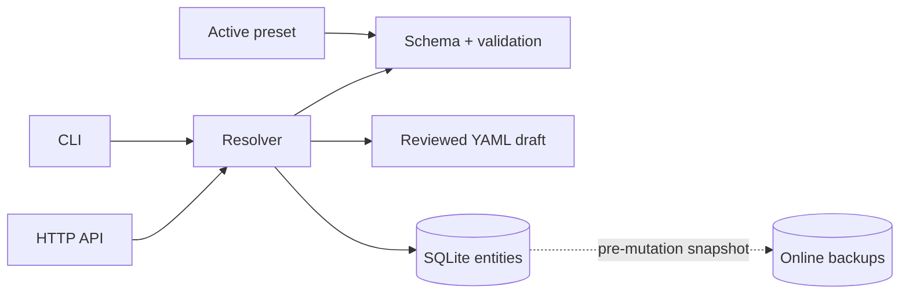

<p align="center">
  
</p>

<p align="center">
  <a href="https://github.com/Krablante/buro/releases"></a>
  
  
  
</p>

<p align="center">
  <a href="./docs/overview.md">Overview</a> ·
  <a href="./docs/architecture.md">Architecture</a> ·
  <a href="./docs/entities.md">Entity model</a> ·
  <a href="./docs/draft-workflow.md">Draft workflow</a> ·
  <a href="./docs/operations.md">Operations</a>
</p>

BURO is a small, typed context registry for AI agents. It turns verified facts
into deterministic answers through one SQLite database, one schema-driven
entity model, and one reviewable write workflow.

No vector database. No scanner. No generated context tree. No distributed pile
of files competing to be the source of truth.

## Why BURO

Agent context is infrastructure. It should be predictable enough to inspect,
cheap enough to query on every turn, and strict enough to reject invented
fields.

| Principle | What it means |
| --- | --- |
| **Deterministic** | The same entity and context produce the same rendered answer. |
| **Typed** | Presets define finite kinds, fields, references, and output sections. |
| **Reviewable** | Every public write starts as YAML and shows a diff before mutation. |
| **Portable** | Local, central, and client modes share one resolver and data model. |
| **Private by design** | Presets define structure; instance facts stay in SQLite. |

## How it fits together



The resolver is the single domain boundary. CLI and HTTP calls use the same
validation, reference checks, rendering, mutation rules, and backup behavior.

## Quick start

BURO requires Node.js 24.14 or newer.

```bash
git clone https://github.com/Krablante/buro.git
cd buro
npm install
npm link

buro init
buro schema
buro list
```

Create the first entity through the reviewed draft workflow:

```bash
buro draft new api service
${EDITOR:-vi} ~/.local/share/buro/BURO_DRAFT.yaml
buro draft diff
buro draft push

buro api
```

`buro init` creates a local instance under `~/.local/share/buro`. Runtime data,
backups, and drafts stay outside the source tree.

## Everyday commands

```text
buro <id>                       render one entity
buro current                    render current-context information
buro list [kind]                list entities, optionally by kind
buro schema                     show the active preset

buro draft pull <id>            prepare an edit
buro draft new <id> [kind]      prepare a creation
buro draft delete <id>          prepare a deletion
buro draft diff                 review the draft
buro draft push                 apply the draft
buro draft clear                discard the draft
```

Administrative commands remain deliberately small: `buro init`, `buro backup`,
and `buro serve`.

## Three operating modes

| Mode | Storage | Intended use |
| --- | --- | --- |
| `local` | Opens local SQLite directly | One machine, no service required |
| `central` | Opens SQLite and serves HTTP | Canonical registry for several hosts |
| `client` | Uses the central HTTP API | Thin workers with no database copy |

Client configuration lives in `~/.config/buro/config.json`:

```json
{
  "mode": "client",
  "current_host": "worker-a",
  "central_host": "registry",
  "api_url": "http://registry:8765"
}
```

See [state and runtime](./docs/state-and-runtime.md) for paths, environment
overrides, backup retention, and deployment boundaries.

## Entity model

Every entity has a stable `id`, human-readable `name`, preset-defined `kind`,
and only the fields allowed for that kind. BURO supports nine finite field
types, including references and nested records. Unknown fields and invalid
references fail before data changes.

The bundled [`politia`](./presets/politia.yaml) preset is both a complete public
example and the model used by Politia. It contains no private instance entities
or deployment topology.

## HTTP surface

```text
GET    /health
GET    /schema
GET    /entities
GET    /entities/:id
POST   /entities/:id
PUT    /entities/:id
DELETE /entities/:id
GET    /packet/entity/:id?current_host=<id>
```

The API is an optional transport, not a second implementation. Local and
multihost installations retain the same entity and draft contracts.

## Project map

```text
presets/politia.yaml  public entity model
src/schema.js         preset loading and typed validation
src/db.js             SQLite storage and online backups
src/resolver.js       shared entity operations
src/draft.js          reviewed YAML writes
src/packet.js         generic entity rendering
src/api.js            optional HTTP transport
src/cli.js            command surface
docs/                 focused architecture and operations guides
```

## Design boundaries

BURO deliberately does not become a RAG pipeline, orchestration platform,
filesystem scanner, plugin ecosystem, or generated documentation system. Its
job is narrower: keep trusted context explicit, typed, inspectable, and fast.

Start with the [overview](./docs/overview.md), then read the
[architecture](./docs/architecture.md) and [draft workflow](./docs/draft-workflow.md).
