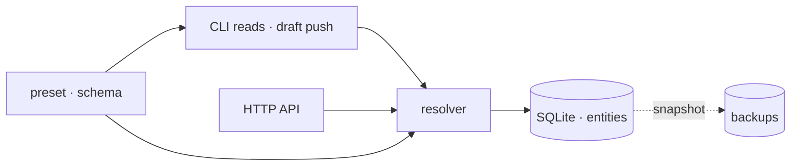

<h1 align="center">BURO</h1>

<p align="center"><strong>Give the agent facts. Skip the séance.</strong></p>

<p align="center">
  <a href="./README.md">🇬🇧 <strong>English</strong></a> · <a href="./README.ru.md">🇷🇺 Русский</a>
</p>

<p align="center">No RAG roulette. No <code>AGENTS.md</code> scavenger hunt. No twelve-box context pipeline.<br>
One boring SQLite file, one reviewed draft, and an answer that does not improvise.</p>

<p align="center">
  
</p>

<p align="center">
  
  
</p>

<p align="center">
  <a href="./docs/overview.md">Overview</a> ·
  <a href="./docs/architecture.md">Architecture</a> ·
  <a href="./docs/draft-workflow.md">Draft workflow</a> ·
  <a href="./docs/operations.md">Operations</a>
</p>

## 🧠 Why this thing exists

Every agent needs facts: where a service runs, which command deploys it, what
you must not touch. Getting those facts into the agent is where the industry
lost its mind.

**RAG is a lottery.** You chunk, embed, retrieve, and hope. The answer wobbles
with the embedding model, the chunk size, and the phase of the moon — and it
rots silently, while somebody pays for the vectors forever.

**`AGENTS.md` is a promise nobody keeps.** A markdown file somewhere in the
repo that drifts, duplicates, gets lost, and has to be re-explained to every
new agent — and re-reminded to the old ones. It is not context. It is a rumor
with a filename.

**"Context platforms" are a second infrastructure.** Pipelines, providers,
plugins, generated context trees — they turn one lookup into a system whose
diagram needs its own diagram, and you get to operate it for the rest of your
life.

BURO is the opposite on purpose. Facts are typed, verified once, and stored in
a boring SQLite file. The agent asks; BURO answers. Same question, same
answer, every time. The world changes? You edit one draft, review one diff,
and press the stamp.

## 🪄 The whole trick

The resolver is the only data door. The CLI and the HTTP API open the same
door, obey the same rules, and cannot invent fields. A preset defines what may
exist; SQLite is the single copy of truth; the ordinary operator write path
starts with one reviewed YAML draft.



## 🎬 The draft loop, for real

<p align="center">
  
</p>

This is generated from the real CLI against a disposable `starter` instance:
initialize, prepare one schema-shaped draft, fill verified facts, inspect the
diff, push, ask. No live registry or hand-written terminal output is involved.

## 🥊 The alternatives, unfortunately

| The problem | The popular answer | Why it fails | BURO |
| --- | --- | --- | --- |
| Where do agent facts live? | RAG: embed everything, hope | probabilistic answers, silent drift, a permanent vector bill | a typed SQLite registry: verified once, rendered deterministically |
| How do agents learn the rules? | `AGENTS.md`, `CLAUDE.md`, `.cursor/rules` | files drift and get lost; you keep reminding agents to read them | `buro current` — one command, one packet, every session |
| What if I have many machines? | a context platform: pipelines, plugins, providers | you now operate a second infrastructure forever | local / central / client — one resolver, no database copies on workers |
| How do operators write? | anyone edits anything, any time | context rots into noise | one ordinary write workflow: reviewed draft, diff, then push |

## 🚀 Put it on your machine

BURO requires Node.js 24.14 or newer.

```bash
git clone https://github.com/Krablante/buro.git
cd buro
npm install
npm link

buro init
buro draft new "$(hostname -s)" host
$EDITOR ~/.local/share/buro/BURO_DRAFT.yaml
buro draft diff
buro draft push
buro current
```

`buro init` creates a local instance under `~/.local/share/buro`. The database
defaults to `~/.local/share/buro/state/buro/buro.sqlite3`; backups sit beside
it under `state/buro/backups/sqlite`, and the draft stays at the instance root.
None of them touches the source tree.

The default `starter` preset asks for two required host facts: its workspace
root and a short summary. The generated draft shows exactly where they go. Add
your first project with `buro draft new my-project`, review it, push it, and the
project appears under `buro current` after its `host` field points at the
current host.

An agent needs one stable bootstrap instruction, not a directory of rules:

```text
Ask BURO first: run `buro current`, then `buro <id>` for the entity in scope.
Treat rendered BURO facts and constraints as authoritative.
```

## ⌨️ The commands you actually need

```text
buro <id>                       render one entity
buro current                    render current-context information
buro list [kind]                list entities, optionally by kind
buro schema                     show the active preset
buro schema <kind>              show sections, fields, types, and guides for one kind

buro draft pull <id>            prepare an edit
buro draft new <id> [kind]      prepare a creation
buro draft delete <id>          prepare a deletion
buro draft diff                 review the draft
buro draft push                 apply the draft
buro draft clear                discard the draft
buro export <file>              export the complete registry
buro import <file> [--adopt]    validate and atomically replace the registry
buro --version                  show the installed version
```

The remaining admin surface is `buro init`, `buro backup`, and `buro serve`.
Export/import is the deliberate portability and whole-schema migration path;
ordinary writes still go through one reviewed draft.

## 🏠 Three operating modes

| Mode | Storage | Intended use |
| --- | --- | --- |
| `local` | Opens local SQLite directly | One machine, no service required |
| `central` | Opens SQLite directly; `buro serve` adds HTTP | Canonical registry for several hosts |
| `client` | Uses the central HTTP API | Thin workers with no database copy |

Client configuration lives in `~/.config/buro/config.json`:

```json
{
  "mode": "client",
  "current_context": "worker-a",
  "central_host": "registry",
  "api_url": "http://registry:8765"
}
```

See [state and runtime](./docs/state-and-runtime.md) for paths, environment
overrides, backup retention, and deployment boundaries.

## 🧬 Entity model

Every entity has a stable `id`, human-readable `name`, preset-defined `kind`,
and only the fields allowed for that kind. BURO supports nine finite field
types, including references and nested records. Unknown fields fail before
data changes; top-level references are checked against their declared target
kind.

Preset guidance makes that structure self-explanatory. A rendered entity
briefly explains every populated section and field; a draft preserves those
descriptions and can add preset-defined instructions for filling a section
correctly. The guidance is presentation metadata, not stored entity data.

The small [`starter`](./presets/starter.yaml) preset is the default. It covers
hosts, projects, services, and documents on one machine or many. The bundled
[`politia`](./presets/politia.yaml) preset is the real production vocabulary
used by Politia. Both contain structure only. Select a bundled preset with
`preset` or `BURO_PRESET`; point `schema_path` or `BURO_SCHEMA_PATH` at your own
declarative YAML to replace the vocabulary without changing the engine.

## 🌐 HTTP surface

```text
GET    /health
GET    /schema
GET    /entities
GET    /entities/:id
POST   /entities/:id
PUT    /entities/:id
DELETE /entities/:id
GET    /packet/entity/:id?current_context=<id>
```

The API is an optional transport, not a second implementation. Its mutation
routes carry client-mode draft pushes as validated entity JSON; the server does
not store a second draft. Updates and deletes carry the entity revision through
`If-Match`, so a stale draft cannot overwrite newer facts. Local and multihost
installations keep the same validation and packet contracts.

There is deliberately no authentication or TLS in the built-in server. Bind
it to loopback or expose it only on a trusted private network behind your own
access boundary.

## 🚫 What BURO refuses to become

- not a RAG pipeline — no embeddings, no chunks, no hope
- not a filesystem scanner — no crawling, no generated context trees
- not an orchestration platform — no plugin model, no providers, no vendor
- not a documentation generator — these docs are written by humans
- not a place for secrets — presets define structure, instance facts stay in
  your own SQLite

## 🔥 Yes, it actually runs

BURO runs Politia — the multihost
environment it was built for — every day, across several machines. It is
equally at home on one laptop.

Made by one person who got tired of reminding agents to read files.

## 🛠️ If you want to poke it

BURO is about reviewed, verified facts — and so is its contribution process.
Say what changed and why; that is the diff that matters. If a PR looks
generated — a wall of polish and no reasoning — expect it to be sent back. No
human should have to read AI slop to review your work.

Open an issue first for anything bigger than a bug fix.

## 📜 License

[MIT](./LICENSE)
