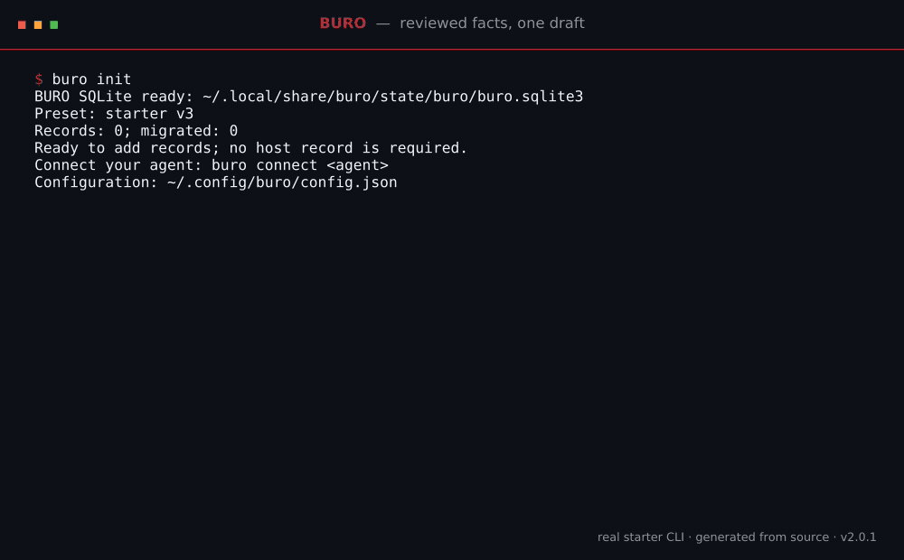

<h1 align="center">BURO</h1>

<p align="center"><strong>Your agent should remember where the work lives.</strong></p>

<p align="center">Recorded facts about your projects, services, machines, and other work.<br>Works with the environment you already have, including scattered folders and multiple computers.</p>

<p align="center"><a href="README.md"><strong>🇬🇧 English</strong></a> · <a href="README.ru.md">🇷🇺 Русский</a></p>

BURO gives your agent useful context between conversations: where a project
lives, which documents explain it, and which decisions or restrictions matter.
One SQLite registry holds the facts. The agent looks up the object it needs and
maintains confirmed information through reviewed changes.

No shared workspace root, folder convention, or host record is required. A
record containing only a name and one important rule is valid. BURO checks
structure and conflicting edits; it cannot prove that a fact is true or current.

## Install and connect

Requires **Node.js 24.14+**. Install the release package:

```sh
npm install -g https://github.com/Krablante/buro/releases/download/v2.0.0/buro-2.0.0.tgz
buro init
buro connect opencodez
```

Choose `opencode`, `codex`, or `claude` instead for those clients. Restart
OpenCode/OpenCodez after installing the plugin; start a new session in the other
clients. For another terminal-capable agent, use
`buro connect file --path /path/to/AGENTS.md`. To edit a System prompt yourself,
copy the output of `buro agent`; `buro agent --full` supplies the detailed workflow.
Connections preserve unrelated instructions and back up files they change.

Then tell your agent, for example: “Remember that my website must only be
published after I approve it.” BURO supplies instructions and a skill; your
agent needs terminal access and permission to maintain records. It does not run
a model, scan your disk, or read chats in the background.

For development, clone this repository, run `npm install`, and use
`node src/cli.js`. A global install is not required.

## A useful record can be small

```yaml
id: my-site
name: My website
kind: project
important:
  - Ask me before publishing.
```

The defaults include `project`, `service`, `host`, and `item`. All content fields
are optional. Names and aliases work in lookups; ambiguous names ask you to
choose an id. `buro search website` discovers records without dumping the registry.

```sh
buro my-site
buro types project
buro draft new my-site project  # or draft pull / draft delete
# Edit the file printed by the command.
buro draft diff
buro draft push
```

One record can have several `locations`, each with its own machine, path, URL,
and purpose. A path without a machine gets the client's current machine when
saved, and that addition appears in the draft diff. Source and runtime can live
on different machines. Existing folder rules belong in records, not in a
mandatory setup questionnaire.



## Configure only what you want to change

Program settings live in `~/.config/buro/config.json`. Type definitions are
separate, self-contained YAML files. Defaults work without editing either.

```json
{
  "type_files": ["project", "service", "host", "item"]
}
```

Use `buro types copy project /path/to/my-project.yaml` to create your own
definition, then replace `"project"` in `type_files` with that file's path.
Custom types can use different fields with the same names. There is no hidden
merging or inheritance: one selected definition per type.

Apply changes with `buro init --dry-run`, then `buro init`. Existing data is
validated first. Removing a populated field or type is rejected without
discarding it. Known v1 `host/path` records migrate to `locations`; the old
starter `document` type becomes `item`. Backups are created before adoption.

## Details

| Topic | English | Русский |
| --- | --- | --- |
| Definitions and migration | [Model](docs/model.md) | [Модель](docs/model.ru.md) |
| Agent connections | [Agents](docs/agents.md) | [Агенты](docs/agents.ru.md) |
| Reviewed changes | [Drafts](docs/draft-workflow.md) | [Черновики](docs/draft-workflow.ru.md) |
| CLI, HTTP, portability | [Interfaces](docs/interfaces.md) | [Интерфейсы](docs/interfaces.ru.md) |
| Storage and boundaries | [Architecture](docs/architecture.md) | [Архитектура](docs/architecture.ru.md) |
| Configuration and deployment | [Operations](docs/operations.md) | [Эксплуатация](docs/operations.ru.md) |

An optional HTTP server shares a registry across machines. Local use requires
no server. The built-in HTTP server has no authentication or TLS; use loopback,
a trusted private network, or an access-controlled proxy.

BURO replaces repeated explanations and scattered copies of durable facts.
Project documentation, coding conventions, and document retrieval still have
their own place. Keep detailed instructions in their owning documents.

## Contribute

Describe the problem, resulting behavior, and practical verification. Keep
private records and operator details out of public files. Licensed under [MIT](LICENSE).
