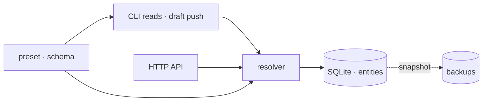
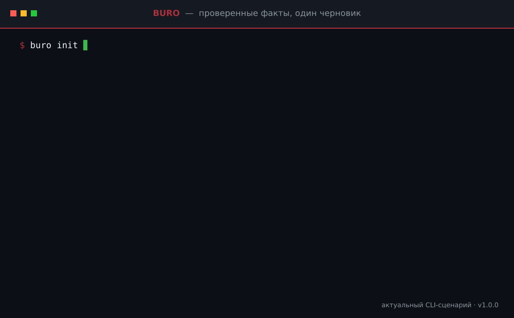

<h1 align="center">BURO</h1>

<p align="center"><strong>Дай агенту факты. Без гаданий на векторах.</strong></p>

<p align="center">
  <a href="./README.md">🇬🇧 English</a> · <a href="./README.ru.md">🇷🇺 <strong>Русский</strong></a>
</p>

<p align="center">Никакой RAG-рулетки. Никаких поисков пропавшего <code>AGENTS.md</code>. Никаких пайплайнов на двенадцать коробок.<br>
Один скучный SQLite-файл, один проверяемый черновик и ответ, который не импровизирует.</p>

<p align="center">
  
</p>

<p align="center">
  
  
</p>

<p align="center">
  <a href="./docs/overview.md">Обзор</a> ·
  <a href="./docs/architecture.md">Архитектура</a> ·
  <a href="./docs/draft-workflow.md">Draft-воркфлоу</a> ·
  <a href="./docs/operations.md">Эксплуатация</a>
</p>

## 🧠 Зачем вообще эта штука

Каждому агенту нужны факты: где крутится сервис, какой командой он
деплоится, к чему нельзя прикасаться. А вот с доставкой этих фактов
индустрия сошла с ума.

**RAG — это лотерея.** Нарезал, эмбеднул, достал — и помолись. Ответ плывёт
от модели эмбеддингов, от размера чанка и от фазы луны. Всё это молча гниёт,
пока ты вечно платишь за вектора.

**`AGENTS.md` — это обещание, которое никто не выполняет.** Маркдаун-файл
где-то в репозитории, который дрейфует, дублируется, теряется, и его
приходится заново объяснять каждому новому агенту — и напоминать старым.
Это не контекст. Это слух с именем файла.

**«Контекстные платформы» — это вторая инфраструктура.** Пайплайны,
провайдеры, плагины, сгенерированные деревья контекста: один запрос
превращается в систему, схема которой требует собственной схемы, — и
обслуживать её тебе до конца жизни.

BURO — осознанная противоположность. Факты типизированы, проверены один раз
и лежат в скучном SQLite-файле. Агент спрашивает — BURO отвечает. Один и
тот же вопрос, один и тот же ответ. Мир поменялся? Правишь один черновик,
смотришь один diff и ставишь штамп.

## 🪄 Весь фокус

Resolver — единственная дверь к данным. CLI и HTTP API открывают одну и ту же
дверь, подчиняются одним правилам и не могут выдумать поля. Пресет определяет,
что вообще может существовать; SQLite — единственная копия правды; обычный
операторский путь записи начинается с одного проверяемого
YAML-черновика.



## 🎬 Настоящий draft-цикл

<p align="center">
  
</p>

GIF собирается из настоящего CLI в одноразовом `starter`-инстансе: инициализация,
один черновик по форме схемы, проверенные факты, diff, push и готовый ответ.
Ни живой реестр, ни нарисованный вручную вывод терминала здесь не участвуют.

## 🥊 Альтернативы, к сожалению

| Проблема | Популярное решение | Почему оно не работает | BURO |
| --- | --- | --- | --- |
| Где живут факты агента? | RAG: заэмбеддь всё, надейся | вероятностные ответы, тихий дрейф, вечный счёт за вектора | типизированный SQLite-реестр: проверил один раз, отвечает детерминированно |
| Как агент узнаёт правила? | `AGENTS.md`, `CLAUDE.md`, `.cursor/rules` | файлы дрейфуют и теряются; агентам вечно напоминаешь их читать | `buro current` — одна команда, один пакет, в каждой сессии |
| А если машин много? | контекстная платформа: пайплайны, плагины, провайдеры | теперь у тебя вторая инфраструктура на всю жизнь | local / central / client — один resolver, на воркерах нет копий базы |
| Как писать оператору? | кто угодно правит что угодно и когда угодно | контекст превращается в шум | один обычный путь: проверяемый черновик, diff, затем push |

## 🚀 Поставить к себе

Нужен Node.js 24.14 или новее.

```bash
git clone https://github.com/Krablante/buro.git
cd buro
npm install
npm link

buro init
buro draft new "$(hostname -s)" host
$EDITOR ~/.local/share/buro/BURO_DRAFT.yaml
buro draft diff
buro draft push
buro current
```

`buro init` создаёт локальный инстанс в `~/.local/share/buro`. База по
умолчанию лежит в `~/.local/share/buro/state/buro/buro.sqlite3`, бэкапы — в
`state/buro/backups/sqlite`, а черновик — в корне инстанса. Дерево исходников
они не трогают.

В default-пресете `starter` у host есть два обязательных факта: корень рабочего
пространства и короткое описание. Сгенерированный черновик сразу показывает,
куда их вписать. Первый проект создаётся через `buro draft new my-project`; как
только его поле `host` укажет на текущий host, он появится в `buro current`.

Агенту нужна одна стабильная входная инструкция, а не каталог правил:

```text
Сначала спроси BURO: выполни `buro current`, затем `buro <id>` для нужной сущности.
Считай отрендеренные факты и ограничения BURO авторитетными.
```

## ⌨️ Команды, которые реально нужны

```text
buro <id>                       отрендерить одну сущность
buro current                    отрендерить текущий контекст
buro list [kind]                список сущностей, опционально по kind
buro schema                     показать активный пресет
buro schema <kind>              показать разделы, поля, типы и guides одного kind

buro draft pull <id>            подготовить правку
buro draft new <id> [kind]      подготовить создание
buro draft delete <id>          подготовить удаление
buro draft diff                 посмотреть diff
buro draft push                 применить черновик
buro draft clear                выбросить черновик
buro export <file>              выгрузить весь реестр
buro import <file> [--adopt]    проверить и атомарно заменить реестр
buro --version                  показать установленную версию
```

Остальной административный интерфейс — `buro init`, `buro backup` и
`buro serve`. Export/import — явный путь переносимости и полной миграции схемы;
обычные изменения по-прежнему проходят через один проверенный черновик.

## 🏠 Три режима работы

| Режим | Хранилище | Для чего |
| --- | --- | --- |
| `local` | Открывает локальный SQLite напрямую | Одна машина, никаких сервисов |
| `central` | Открывает SQLite напрямую; `buro serve` добавляет HTTP | Канонический реестр для нескольких хостов |
| `client` | Ходит в центральный HTTP API | Тонкие воркеры без копии базы |

Конфиг клиента лежит в `~/.config/buro/config.json`:

```json
{
  "mode": "client",
  "current_context": "worker-a",
  "central_host": "registry",
  "api_url": "http://registry:8765"
}
```

Пути, переменные окружения, ротация бэкапов и границы деплоя — в
[state and runtime](./docs/state-and-runtime.md).

## 🧬 Модель сущностей

У каждой сущности есть стабильный `id`, человекочитаемый `name`, `kind` из
пресета — и только те поля, которые этому kind разрешены. BURO поддерживает
девять конечных типов полей, включая ссылки и вложенные записи. Неизвестные
поля отклоняются до изменения данных; ссылки верхнего уровня сверяются со
своим объявленным target kind.

Guidance из пресета делает эту структуру самопонятной. Готовая сущность кратко
объясняет каждый непустой раздел и поле; draft сохраняет эти пояснения и может
добавлять инструкции по правильному заполнению раздела. Эти пояснения —
presentation metadata, а не данные сущности.

Маленький [`starter`](./presets/starter.yaml) — default-пресет. Он покрывает
hosts, projects, services и documents на одной машине или на нескольких.
Встроенный [`politia`](./presets/politia.yaml) — реальный production-словарь,
на котором работает Politia. Оба содержат только структуру. Встроенный пресет
выбирается через `preset` или `BURO_PRESET`; `schema_path` или
`BURO_SCHEMA_PATH` подключает собственный декларативный YAML без изменения
движка.

## 🌐 HTTP-поверхность

```text
GET    /health
GET    /schema
GET    /entities
GET    /entities/:id
POST   /entities/:id
PUT    /entities/:id
DELETE /entities/:id
GET    /packet/entity/:id?current_context=<id>
```

API — опциональный транспорт, а не вторая реализация. Маршруты записи переносят
client-mode push как провалидированный JSON сущности; второго черновика на
сервере нет. Update и delete передают revision сущности через `If-Match`, поэтому
устаревший черновик не может затереть более новые факты. Локальная и
мультихостовая установки сохраняют одни и те же контракты валидации и рендера.

Встроенный сервер намеренно не занимается аутентификацией и TLS. Привязывай
его к loopback либо открывай только в доверенной приватной сети за собственным
контуром доступа.

## 🚫 Во что BURO не превратится

- не RAG-пайплайн — никаких эмбеддингов, чанков и надежды
- не сканер файловой системы — никакого кравлинга и деревьев контекста
- не платформа оркестрации — никакой модели плагинов, провайдеров и вендоров
- не генератор документации — эти доки писали люди
- не место для секретов — пресеты задают структуру, а факты инстанса живут
  в твоём собственном SQLite

## 🔥 Да, оно правда работает

BURO каждый день работает в Politia — мультихост-среде, ради которой и был
написан. Пакет этого самого репозитория отдаётся из него. На одной машине
ему так же хорошо.

Сделано одним человеком, который устал напоминать агентам читать файлы.

## 🛠️ Если хочется поковырять

BURO — про проверенные, выверенные факты. И контрибьюция у нас такая же.
Объясни, что и зачем меняешь, — это и есть главный diff. Если PR выглядит
сгенерированным — стена полировки без рассуждений, — готовься, что его
завернут. Ни один человек не должен тратить время на чтение ИИ-слопа, чтобы
проверить твою работу.

Для всего крупнее багфикса сначала открой issue.

## 📜 Лицензия

[MIT](./LICENSE)
