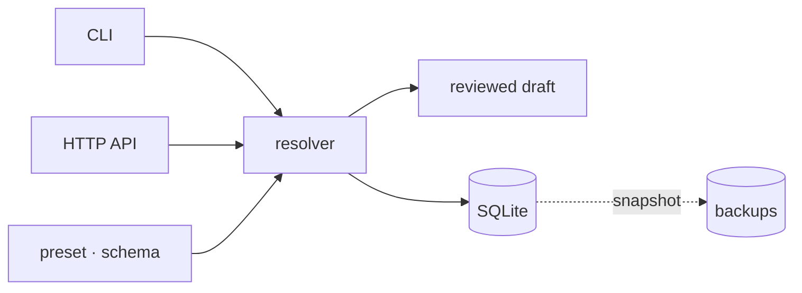

<p align="center">
  <a href="./README.md">English</a> · <a href="./README.ru.md">Русский</a>
</p>

<h1 align="center">BURO</h1>

<p align="center"><strong>Контекст, который переживает встречу с реальностью.</strong></p>

<p align="center">Никакого RAG. Никакого <code>AGENTS.md</code>. Никаких контекстных пайплайнов.<br>
Один SQLite-файл, одна схема, один проверяемый черновик — и одинаковый ответ каждый раз, когда спросишь.</p>

<p align="center">
  
  
</p>

<p align="center">
  <a href="./docs/overview.md">Обзор</a> ·
  <a href="./docs/architecture.md">Архитектура</a> ·
  <a href="./docs/draft-workflow.md">Draft-воркфлоу</a> ·
  <a href="./docs/operations.md">Эксплуатация</a>
</p>

## Зачем это существует

Каждому агенту нужны факты: где крутится сервис, какой командой он
деплоится, к чему нельзя прикасаться. А вот с доставкой этих фактов
индустрия сошла с ума.

**RAG — это лотерея.** Нарезал, эмбеднул, достал — и помолись. Ответ плывёт
от модели эмбеддингов, от размера чанка и от фазы луны. Всё это молча гниёт,
пока ты вечно платишь за вектора.

**`AGENTS.md` — это обещание, которое никто не выполняет.** Маркдаун-файл
где-то в репозитории, который дрейфует, дублируется, теряется, и его
приходится заново объяснять каждому новому агенту — и напоминать старым.
Это не контекст. Это слух с именем файла.

**«Контекстные платформы» — это вторая инфраструктура.** Пайплайны,
провайдеры, плагины, сгенерированные деревья контекста: один запрос
превращается в систему, схема которой требует собственной схемы, — и
обслуживать её тебе до конца жизни.

BURO — осознанная противоположность. Факты типизированы, проверены один раз
и лежат в скучном SQLite-файле. Агент спрашивает — BURO отвечает. Один и
тот же вопрос, один и тот же ответ. Мир поменялся? Правишь один черновик,
смотришь один diff и ставишь штамп.

## Как это устроено

Resolver — единственная дверь. CLI и HTTP API открывают одну и ту же дверь,
подчиняются одним правилам и не могут выдумать поля. Пресет определяет, что
вообще может существовать; SQLite — единственная копия правды; каждая запись
проходит через один проверяемый YAML-черновик.



## Экскурсия на 60 секунд

```console
$ buro init
BURO SQLite ready: ~/.local/share/buro/buro.sqlite3

$ buro schema
BURO schema: politia v2
default kind: project
context kind: host
kinds: project · service · external · lab · dotmd · skill · host

$ buro draft new api service
BURO draft ready
mode: new service
id: api
file: ~/.local/share/buro/BURO_DRAFT.yaml
```

Заполняешь факты. Незаполненные поля остаются закомментированными; неизвестных
полей не существует:

```yaml
id: api
name: API
kind: service
category: backend
summary: Public API for Acme. Owns /v1/* and the webhook receiver.
important:
  - Deploys only through the release pipeline.
  - Never restart the database from the API host.
```

```console
$ buro draft diff
BURO draft diff
mode: new entity
id: api

--- new entity
+++ draft
+ id: api
+ name: API
+ kind: service
+ category: backend
+ summary: Public API for Acme. Owns /v1/* and the webhook receiver.
+ important:
+   - Deploys only through the release pipeline.
+   - Never restart the database from the API host.

$ buro draft push
BURO draft pushed
action: created
id: api

$ buro api
BURO Entity: service:api
Name: API

IDENTITY:
  category: backend

SUMMARY:
  summary: Public API for Acme. Owns /v1/* and the webhook receiver.

IMPORTANT:
  important:
    - Deploys only through the release pipeline.
    - Never restart the database from the API host.
```

Это весь цикл: черновик, diff, штамп. Через него проходит каждая запись в
BURO — включая твою.

## Почему не X

| Проблема | Популярное решение | Почему оно не работает | BURO |
| --- | --- | --- | --- |
| Где живут факты агента? | RAG: заэмбеддь всё, надейся | вероятностные ответы, тихий дрейф, вечный счёт за вектора | типизированный SQLite-реестр: проверил один раз, отвечает детерминированно |
| Как агент узнаёт правила? | `AGENTS.md`, `CLAUDE.md`, `.cursor/rules` | файлы дрейфуют и теряются; агентам вечно напоминаешь их читать | `buro current` — одна команда, один пакет, в каждой сессии |
| А если машин много? | контекстная платформа: пайплайны, плагины, провайдеры | теперь у тебя вторая инфраструктура на всю жизнь | local / central / client — один resolver, на воркерах нет копий базы |
| Кто может писать? | кто угодно, когда угодно | контекст превращается в шум | один проверяемый черновик на запись, diff перед push |

## Быстрый старт

Нужен Node.js 24.14 или новее.

```bash
git clone https://github.com/Krablante/buro.git
cd buro
npm install
npm link

buro init
buro schema
buro list
```

`buro init` создаёт локальный инстанс в `~/.local/share/buro`. Данные,
бэкапы и черновики живут вне дерева исходников.

## Команды на каждый день

```text
buro <id>                       отрендерить одну сущность
buro current                    отрендерить контекст текущего хоста
buro list [kind]                список сущностей, опционально по kind
buro schema                     показать активный пресет

buro draft pull <id>            подготовить правку
buro draft new <id> [kind]      подготовить создание
buro draft delete <id>          подготовить удаление
buro draft diff                 посмотреть diff
buro draft push                 применить черновик
buro draft clear                выбросить черновик
```

Это весь административный интерфейс: `buro init`, `buro backup` и
`buro serve`. Больше его не станет.

## Три режима работы

| Режим | Хранилище | Для чего |
| --- | --- | --- |
| `local` | Открывает локальный SQLite напрямую | Одна машина, никаких сервисов |
| `central` | Открывает SQLite и отдаёт HTTP | Канонический реестр для нескольких хостов |
| `client` | Ходит в центральный HTTP API | Тонкие воркеры без копии базы |

Конфиг клиента лежит в `~/.config/buro/config.json`:

```json
{
  "mode": "client",
  "current_host": "worker-a",
  "central_host": "registry",
  "api_url": "http://registry:8765"
}
```

Пути, переменные окружения, ротация бэкапов и границы деплоя — в
[state and runtime](./docs/state-and-runtime.md).

## Модель сущностей

У каждой сущности есть стабильный `id`, человекочитаемый `name`, `kind` из
пресета — и только те поля, которые этому kind разрешены. BURO поддерживает
девять конечных типов полей, включая ссылки и вложенные записи. Неизвестные
поля и невалидные ссылки отклоняются до того, как данные изменятся.

Встроенный пресет [`politia`](./presets/politia.yaml) — это и полный
публичный пример, и модель, на которой работает Politia. В нём нет ни одной
приватной сущности и никакой топологии деплоя.

## HTTP-поверхность

```text
GET    /health
GET    /schema
GET    /entities
GET    /entities/:id
POST   /entities/:id
PUT    /entities/:id
DELETE /entities/:id
GET    /packet/entity/:id?current_host=<id>
```

API — опциональный транспорт, а не вторая реализация. Локальная и
мультихостовая установки сохраняют одни и те же контракты сущностей и
черновиков.

## Чем BURO не является

- не RAG-пайплайн — никаких эмбеддингов, чанков и надежды
- не сканер файловой системы — никакого кравлинга и деревьев контекста
- не платформа оркестрации — никакой модели плагинов, провайдеров и вендоров
- не генератор документации — эти доки писали люди
- не место для секретов — пресеты задают структуру, а факты инстанса живут
  в твоём собственном SQLite

## Где это работает

BURO каждый день работает в Politia — мультихост-среде, ради которой и был
написан. Пакет этого самого репозитория отдаётся из него. На одной машине
ему так же хорошо.

Сделано одним человеком, который устал напоминать агентам читать файлы.

## Контрибьюция

BURO — про проверенные, выверенные факты. И контрибьюция у нас такая же.
Объясни, что и зачем меняешь, — это и есть главный diff. Если PR выглядит
сгенерированным — стена полировки без рассуждений, — готовься, что его
завернут. Ни один человек не должен тратить время на чтение ИИ-слопа, чтобы
проверить твою работу.

Для всего крупнее багфикса сначала открой issue.

## Лицензия

[MIT](./LICENSE)
