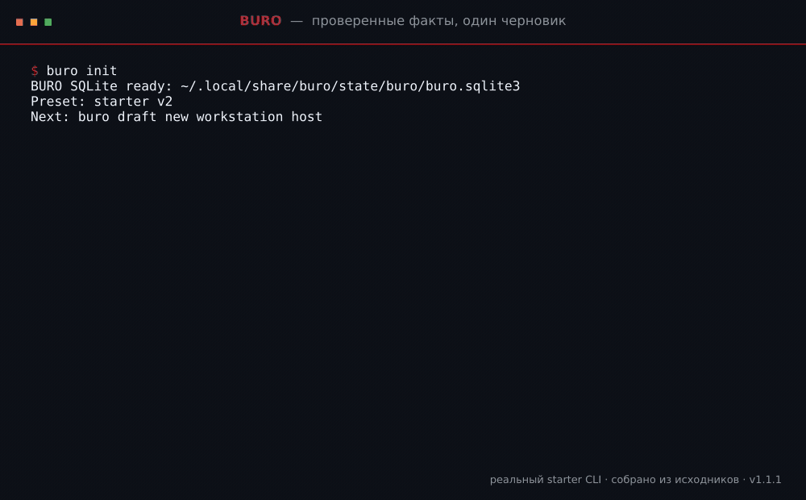

<h1 align="center">BURO</h1>

<p align="center"><strong>Агент должен помнить, где находится ваша работа.</strong></p>

<p align="center">Сведения о проектах, сервисах, компьютерах и других объектах работы.<br>Для вашей существующей среды — с любыми папками и любым количеством машин.</p>

<p align="center"><a href="README.md">🇬🇧 English</a> · <a href="README.ru.md"><strong>🇷🇺 Русский</strong></a></p>

BURO сохраняет полезный контекст между разговорами: где находится проект, что
читать о нём и какие решения или ограничения учитывать. Факты хранятся в одном
реестре SQLite. Агент получает нужную запись и поддерживает подтверждённые
сведения через изменения с проверкой diff и версии записи.

Общий корень, геометрия папок и запись хоста не обязательны. Запись с именем и
одним важным правилом уже допустима. BURO проверяет структуру и конфликты правок,
но не может доказать правдивость или актуальность сведений.

## Установить и подключить

Нужен **Node.js 24.14+**. Установите пакет релиза:

```sh
npm install -g https://github.com/Krablante/buro/releases/download/v2.0.0/buro-2.0.0.tgz
buro init
buro connect opencodez
```

Для других клиентов выберите `opencode`, `codex` или `claude`. После установки
плагина перезапустите OpenCode/OpenCodez; в остальных клиентах начните новую
сессию. Для другого агента с терминалом используйте
`buro connect file --path /путь/к/AGENTS.md`. Для самостоятельного редактирования
System prompt скопируйте вывод `buro agent`; подробные правила выдаёт
`buro agent --full`. Подключение сохраняет посторонние инструкции и создаёт
резервные копии изменяемых файлов.

Затем скажите агенту: «Запомни: публиковать мой сайт можно только после моего
разрешения». BURO поставляет инструкции и skill; агенту нужен доступ к терминалу
и разрешение поддерживать записи. BURO не запускает модель, не сканирует диск
и не читает разговоры в фоне.

Для разработки клонируйте репозиторий, выполните `npm install` и запускайте
`node src/cli.js`. Глобальная установка не требуется.

## Полезная запись может быть короткой

```yaml
id: my-site
name: Мой сайт
kind: project
important:
  - Перед публикацией спросить меня.
```

Готовые типы: `project`, `service`, `host`, `item`. Содержательные поля
необязательны. Запись можно получить по имени или алиасу; при неоднозначности
BURO предлагает выбрать id. `buro search сайт` помогает найти нужное без
загрузки всего реестра.

```sh
buro my-site
buro types project
buro draft new my-site project  # либо draft pull / draft delete
# Отредактируйте файл, указанный командой.
buro draft diff
buro draft push
```

У объекта может быть несколько `locations`: машина, путь, URL и назначение.
Для пути без машины при сохранении записывается текущая машина клиента; это
добавление видно в diff. Исходники и рабочая версия могут находиться в разных
местах. Существующие правила папок хранятся как сведения в записях.



## Настраивайте только то, что хотите изменить

Настройки программы находятся в `~/.config/buro/config.json`. Определения типов
— отдельные самодостаточные YAML-файлы. Готовые defaults работают без их правки.

```json
{
  "type_files": ["project", "service", "host", "item"]
}
```

Команда `buro types copy project /путь/my-project.yaml` копирует готовое
определение. Замените `"project"` в `type_files` путём к этому файлу.
Разные типы могут по-разному определять одноимённые поля. Скрытого объединения
и наследования нет: у каждого типа одно выбранное определение.

Проверяйте изменения через `buro init --dry-run`, применяйте через `buro init`.
BURO сначала проверяет существующие данные. Удаление заполненного поля или типа
отклоняется без потери данных. Известные записи v1 с `host/path` переносятся в
`locations`; прежний тип `document` стартовой модели становится `item`.
Перед применением создаётся резервная копия.

## Подробности

| Тема | English | Русский |
| --- | --- | --- |
| Определения и миграция | [Model](docs/model.md) | [Модель](docs/model.ru.md) |
| Подключение агентов | [Agents](docs/agents.md) | [Агенты](docs/agents.ru.md) |
| Изменения записей | [Drafts](docs/draft-workflow.md) | [Черновики](docs/draft-workflow.ru.md) |
| CLI, HTTP, перенос | [Interfaces](docs/interfaces.md) | [Интерфейсы](docs/interfaces.ru.md) |
| Хранение и границы | [Architecture](docs/architecture.md) | [Архитектура](docs/architecture.ru.md) |
| Настройки и развёртывание | [Operations](docs/operations.md) | [Эксплуатация](docs/operations.ru.md) |

Необязательный HTTP-сервер предоставляет один реестр нескольким машинам.
Локальная работа сервера не требует. Встроенный сервер не содержит авторизации
и TLS: используйте loopback, доверенную частную сеть или защищённый proxy.

BURO убирает повторные объяснения и разбросанные копии устойчивых сведений.
Подробная документация, соглашения о коде и поиск по документам сохраняют свои
задачи. Не переносите полные руководства в записи.

## Участие в разработке

Опишите проблему, итоговое поведение и практическую проверку. Не включайте
приватные записи и операторские подробности в публичные файлы. Лицензия [MIT](LICENSE).
